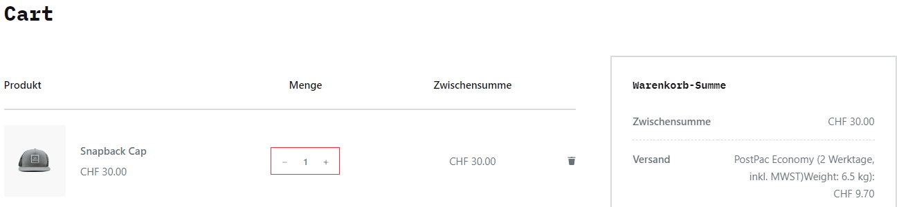
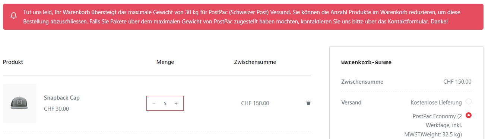
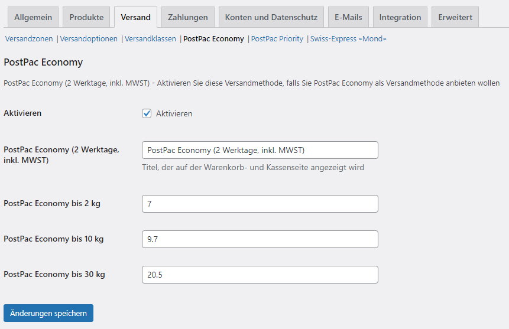

# WooCommerce Simple Weight post.ch Shipping #

## Beschreibung ##

### Einfaches gewichtbasierter Versand für das PostPac-Paketangebot der Schweizer Post (post.ch) ###

Natürlich funktioniert das nur, wenn im Produkt eine Gewichtsangabe steht:

Im Warenkorb wird die ausgewählte PostPac-Versandmethode angezeigt, mit dem entsprechenden Pakettarif für das Gesamtgewicht des Warenkorbs.

Da die PostPac-Versandtarife nur bis 30 kg gelten, gibt es automatisch eine Warnung, falls das Gesamtgewicht des Warenkorbs darüber liegt. Bis der Warenkorb wieder unter 30 kg liegt, wird der Zugang zur Kassenseite blockiert.

Die PostPac-Versandmethoden gelten nur innerhalb der Schweiz und die Gewichtstarife können in den WooCommmerce-Einstellungen frei angepasst werden. Es gibt die Möglichkeite, PostPac Economy, PostPac Priority und Swiss-Express "Mond" zu aktivieren.

## Installation ##
Oben rechts das Plugin als ZIP-Datei runterladen und das Plugin-Verzeichnis auspacken.

Es gibt folgende zwei Möglichkeiten der Installation:

1. Plugin-Verzeichnis in das Verzeichnis `/wp-content/plugins/` raufladen und anschliessend Plugin in WordPress aktivieren.
2. Plugin durch "Plugins" - "Installieren" - "Plugin Hochladen" in WordPress raufladen und anschliessend Plugin aktivieren.

Sprachdatei Deutsch liegt bei. Texte über LocoTranslate abändern.

## Changelog ##

### 1.0.0 ###
Erste Version: Getestet mit Woocommerce 6.5.1 und WordPress 6.0
